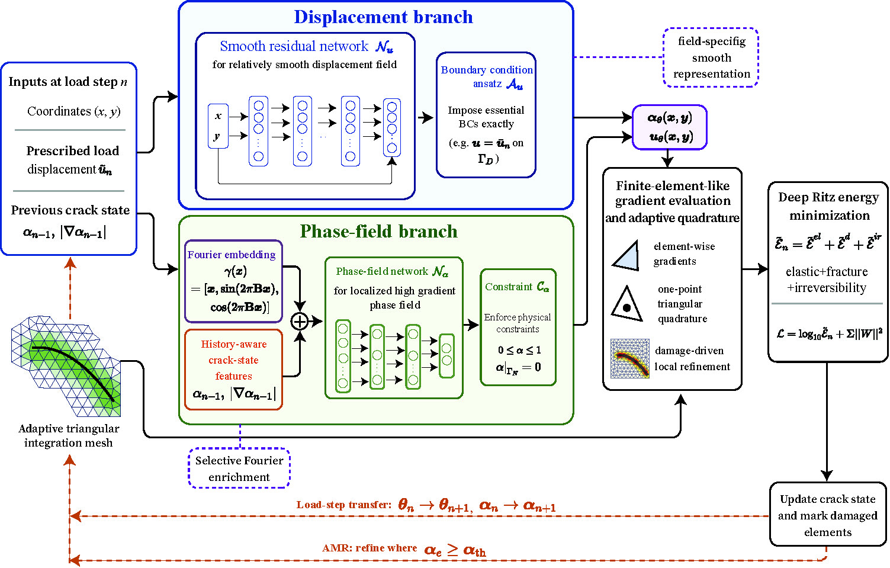
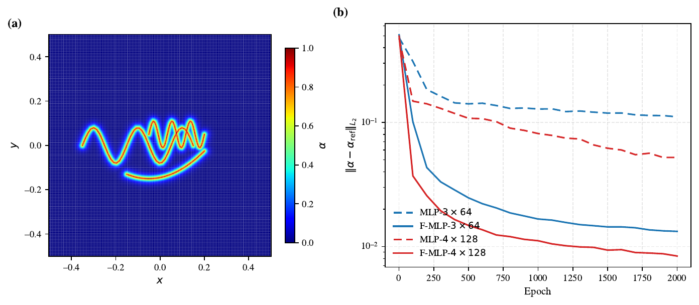
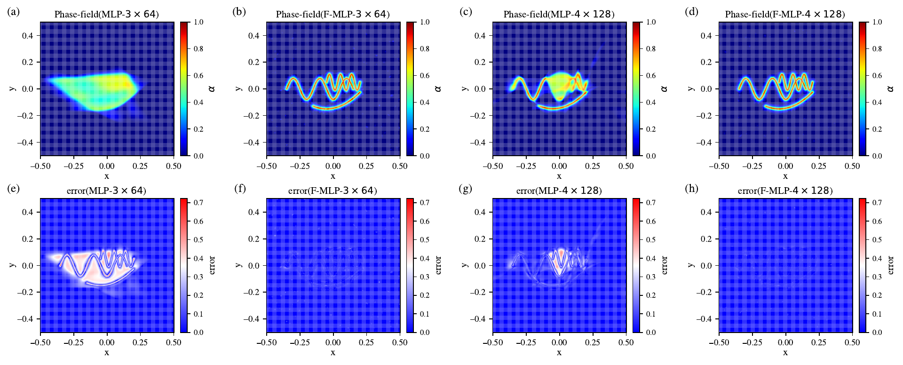
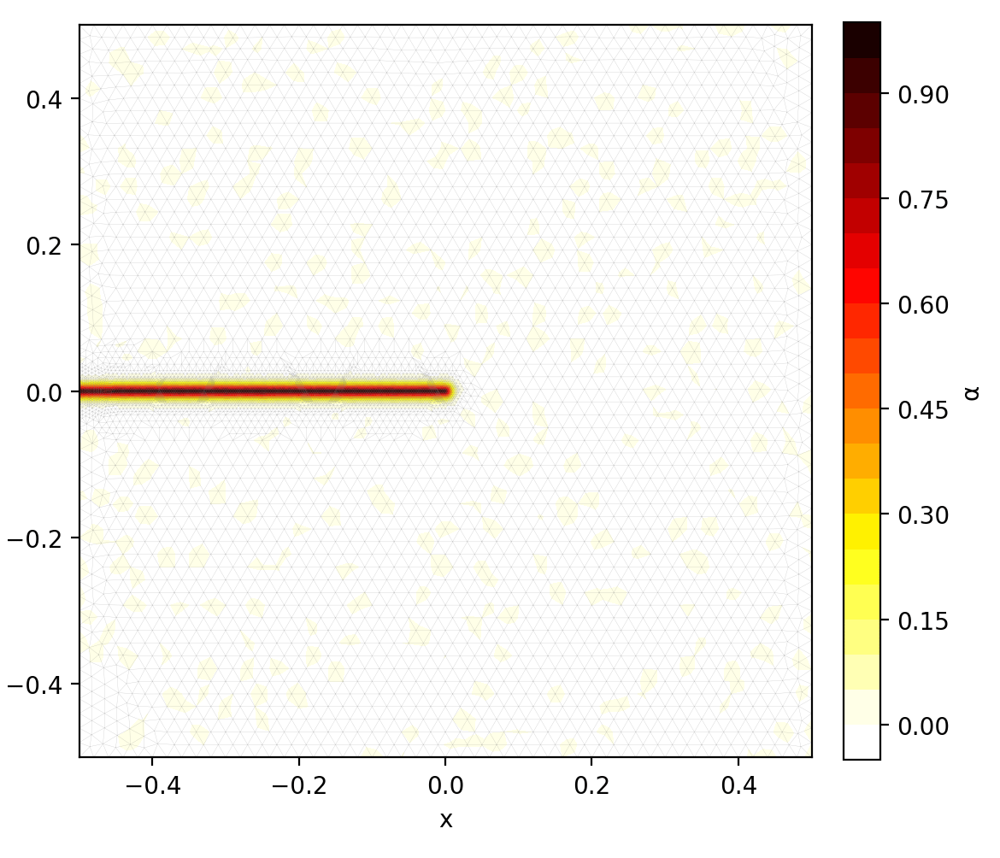
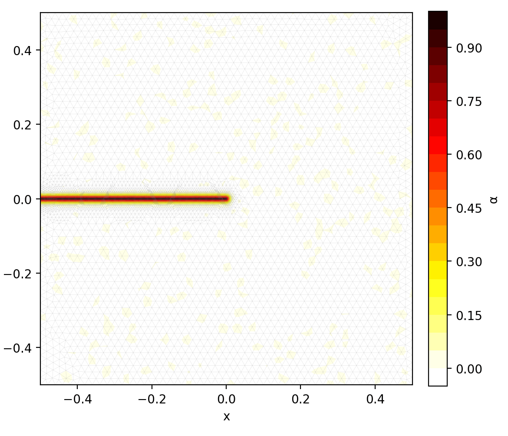
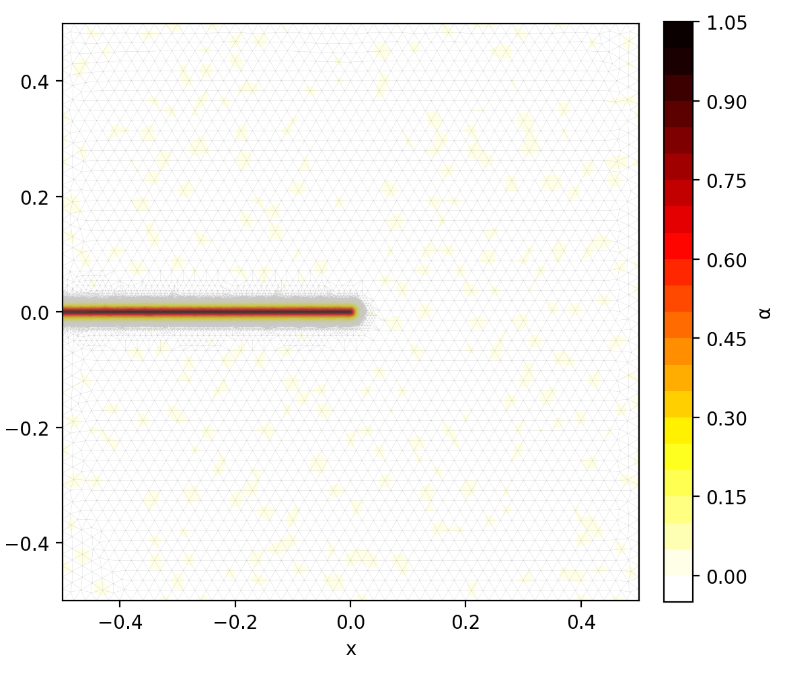
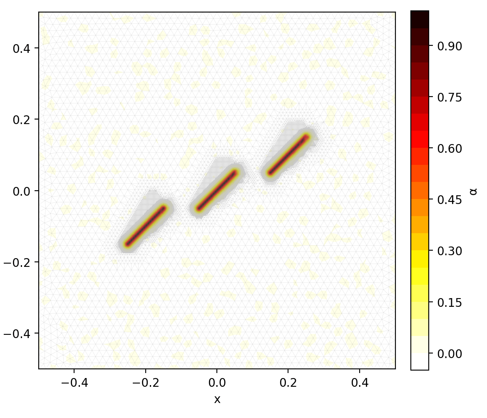
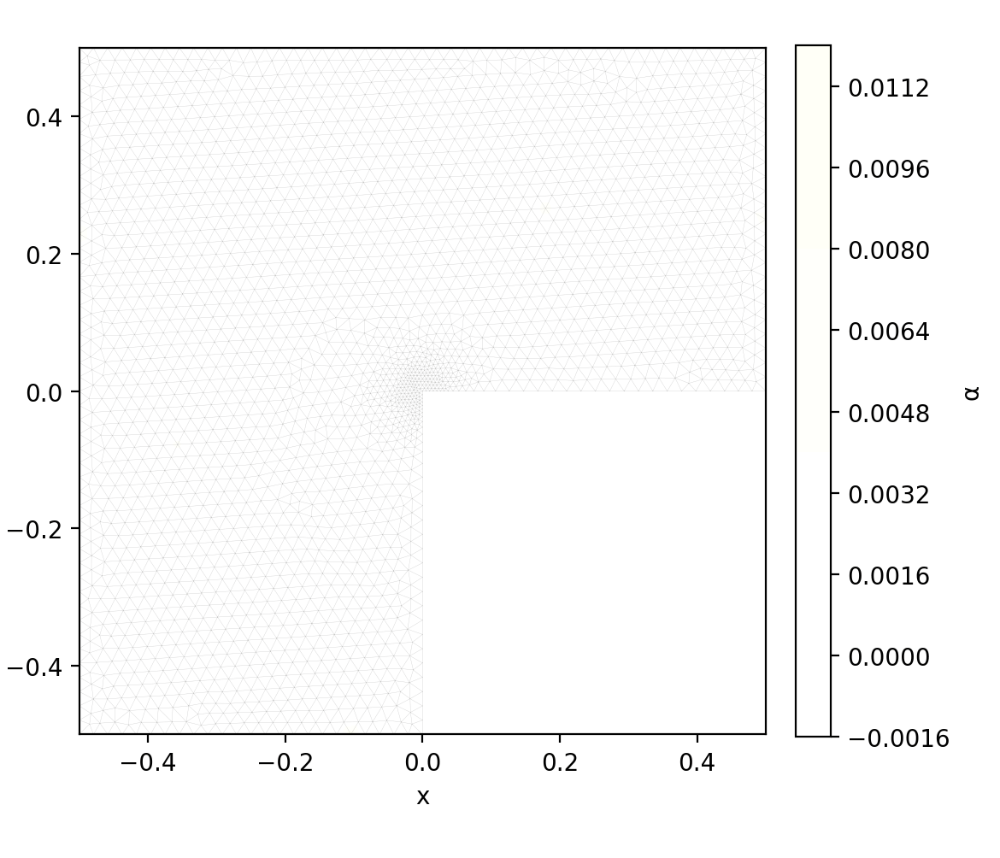
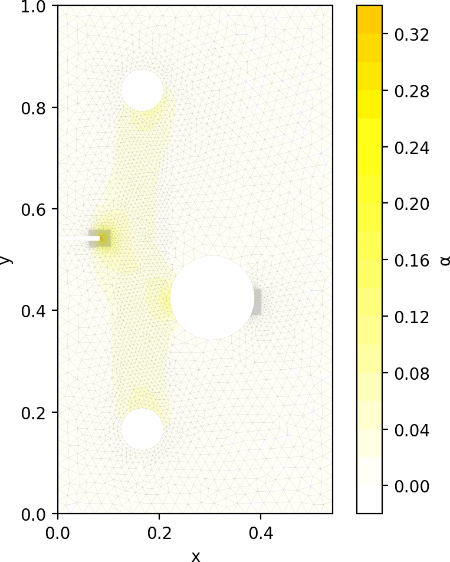

# RA-DualDRM

**A physics-adapted dual-network Deep Ritz method with adaptive mesh integration
for phase-field crack propagation analysis**

[](https://doi.org/10.1016/j.engfracmech.2026.112573)

Official implementation and representative results for the paper published in
*Engineering Fracture Mechanics* (2026), article 112573:
[DOI](https://doi.org/10.1016/j.engfracmech.2026.112573) ·
[ScienceDirect](https://www.sciencedirect.com/science/article/pii/S0013794426007356)

RA-DualDRM addresses the inefficient representation of localized phase-field
fracture by standard single-network MLP-based Deep Ritz methods. It combines a
smooth residual network for displacement with Fourier feature enrichment for
the high-gradient phase field, while damage-driven adaptive integration focuses
quadrature resolution around the evolving crack.

## Method

- Separate networks reflect the different regularities of displacement and
  phase fields.
- Fourier features improve the representation of narrow, localized crack bands.
- Previous-step damage information supports irreversible crack evolution.
- Adaptive triangular integration refines around predicted damage without
  adding neural degrees of freedom.

<p align="center">
  
</p>

Across the reported benchmarks, RA-DualDRM uses fewer parameters than the
reproduced 8 × 400 single-network DRM baseline, achieves up to **5.33× speedup**,
and reduces peak GPU memory to as low as **29% of the baseline**. In the
notched-hole test, adaptive integration reduces GPU memory usage from about
**95% to 30%** compared with a locally pre-refined mesh.

## Fourier-feature analysis

The following comparisons demonstrate the advantage of Fourier enrichment for
localized, high-gradient phase fields.

<p align="center">
  
  <br><a href="fig/B_curve_fig1.pdf">Vector PDF</a>
</p>

<p align="center">
  
  <br><a href="fig/B_curve_fig2.pdf">Vector PDF</a>
</p>

## Crack and adaptive-mesh evolution

Each animation shows the phase field together with its evolving adaptive
triangular integration mesh.

<table>
  <tr>
    <td align="center" width="50%">
      <b>Single-edge notched tension</b><br>
      <br>
      <a href="results_media/outputs/phase_evolution_tensile.mp4">MP4</a>
    </td>
    <td align="center" width="50%">
      <b>Single-edge notched shear</b><br>
      <br>
      <a href="results_media/outputs/phase_evolution_shear.mp4">MP4</a>
    </td>
  </tr>
  <tr>
    <td align="center" width="50%">
      <b>Crack bifurcation</b><br>
      <br>
      <a href="results_media/outputs/phase_evolution_bifurcation.mp4">MP4</a>
    </td>
    <td align="center" width="50%">
      <b>Crack coalescence</b><br>
      <br>
      <a href="results_media/outputs/phase_evolution_coalescence.mp4">MP4</a>
    </td>
  </tr>
  <tr>
    <td align="center" width="50%">
      <b>L-shaped panel</b><br>
      <br>
      <a href="results_media/outputs/phase_evolution_lpanel.mp4">MP4</a>
    </td>
    <td align="center" width="50%">
      <b>Notched-hole plate</b><br>
      <br>
      <a href="results_media/outputs/phase_evolution_notched_hole.mp4">MP4</a>
    </td>
  </tr>
</table>

## Code

```text
Coalescence_RADualNet.py       crack-coalescence benchmark
Shear_RADualNet.py             single-edge notched shear benchmark
bifurcation_RADualNet.py       crack-bifurcation benchmark
NotchedHole_RADualNet.py       notched-hole benchmark
mesh/                          initial triangular meshes
Fourier/                       Fourier-feature analysis
FEM/                           FEniCSx reference implementation
fig/                           architecture and analysis figures
results_media/outputs/         representative GIF and MP4 results
```

The main examples require PyTorch, NumPy, Matplotlib, MeshIO, gmshparser, and
TensorBoard. Install a PyTorch build suitable for your CPU or GPU, then run a
benchmark from the repository root, for example:

```bash
python -m pip install numpy matplotlib meshio gmshparser tensorboard
python Coalescence_RADualNet.py
```

Network, material, loading, optimization, and refinement parameters are defined
near the beginning of each benchmark script. The `FEM/` reference additionally
requires a compatible FEniCSx environment.

## Citation

```bibtex
@article{Wang2026RADualDRM,
  title   = {RA-DualDRM: A physics-adapted dual-network Deep Ritz method with
             adaptive mesh integration for phase-field crack propagation analysis},
  author  = {Wang, Xiaoqiang and Sheng, Mao and Li, Peichao and
             Wang, Changji and Lu, Detang},
  journal = {Engineering Fracture Mechanics},
  year    = {2026},
  pages   = {112573},
  issn    = {0013-7944},
  doi     = {10.1016/j.engfracmech.2026.112573}
}
```

Citation metadata are also available in [`CITATION.cff`](CITATION.cff).
